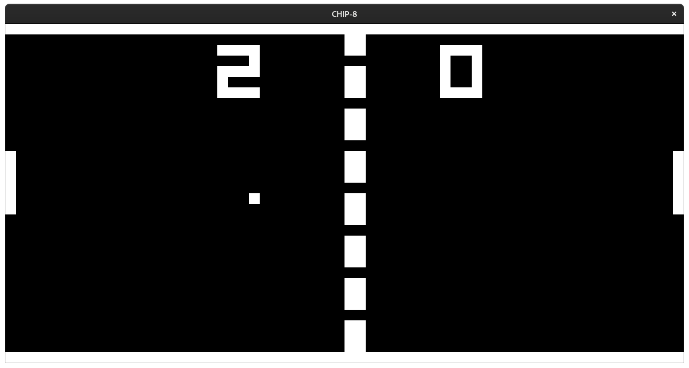
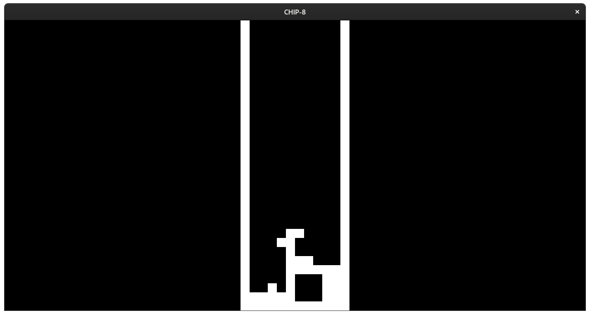

# CHIP-8 emulator

This is a basic c++ CHIP-8 emulator. I made it after reading this article https://multigesture.net/articles/how-to-write-an-emulator-chip-8-interpreter/.  
I can only recommend you to check it, it's a great introduction to emulation.

The graphics have been made with GLFW (OpenGL) and Glad. It's my first time using it so the code is probably bad.

Pong

Tetris
